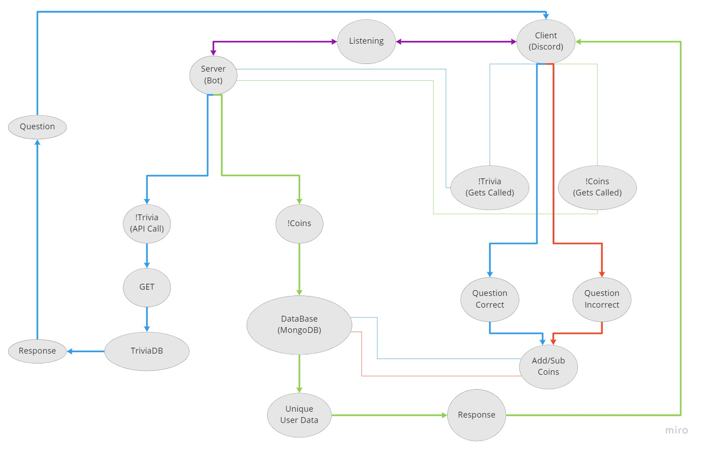

# Testing-Intelligence-Machine-TIM

<div id="top"></div>

[![LinkedIn][linkedin-shield]][linkedin-url]
[![GitHub][github-shield]][github-url]
<br />
[![LinkedIn][linkedin-shieldanthony]][linkedin-urlanthony]
[![GitHub][github-shieldanthony]][github-urlanthony]
<br />
[![LinkedIn][linkedin-shieldbryce]][linkedin-urlbryce]
[![GitHub][github-shieldbryce]][github-urlbryce]
<br />
[![LinkedIn][linkedin-shieldvalton]][linkedin-urlvalton]
[![GitHub][github-shieldvalton]][github-urlvalton]

<!-- TABLE OF CONTENTS -->
<details>
  <summary>Table of Contents</summary>
  <ol>
    <li>
      <a href="#about-the-project">About The Project</a>
      <ul>
        <li><a href="#built-with">Built With</a></li>
      </ul>
    </li>
    <li>
      <a href="#getting-started">Getting Started</a>
      <ul>
        <li><a href="#prerequisites">Prerequisites</a></li>
        <li><a href="#installation">Installation</a></li>
      </ul>
    </li>
    <li><a href="#usage">Usage</a></li>
    <li><a href="#roadmap">Roadmap</a></li>
    <li><a href="#contributing">Contributing</a></li>
    <li><a href="#license">License</a></li>
    <li><a href="#contact">Contact</a></li>
    <li><a href="#acknowledgments">Acknowledgments</a></li>
  </ol>
</details>

<!-- ABOUT THE PROJECT -->

## About The Project

-> T.I.M. is a discord bot centered around an economy system designed to increase interactivity between users, channels, and guilds.

Problem Domain:

- To create a Discord Bot for entertainment and self education

Project Management Board:

(https://trello.com/b/wxY50tfV/401-trello)

UML-ver1:


<br />

UML-ver2:



<br />

UML-ver3:


<br />

Schema-ver1:


<br />

Schema-ver2:


<p align="right">(<a href="#top">back to top</a>)</p>

## Project Dependencies

### Prerequisites

This is an example of how to list things you need to use the software and how to install them.

- npm
  ```
  npm install npm@latest -g
  ```
 - heroku
  ```
  npm install heroku
  ```
 - express
  ```
  npm install express
  ```
 - jest
  ```
  npm install jest
  ```
 - slappery
  ```
  npm install slappery
  ```
 - mongoose
  ```
  npm install mongoose
  ```
 - node-fetch
  ```
  npm install node-fetch
  ```
 - dotenv
  ```
  npm install dotenv
  ```
 - cors
  ```
  npm install cors
  ```
 - discord
  ```
  npm install discord
  ```
### Installation

- Any installations required.

<p align="right">(<a href="#top">back to top</a>)</p>

## Usage

For reference on where to sue out App

- [Discord](https://discord.com)

<p align="right">(<a href="#top">back to top</a>)</p>

<!-- CONTRIBUTING -->

## Contributing

1. Fork the Project
2. Create your Feature Branch (`git checkout -b feature/AmazingFeature`)
3. Commit your Changes (`git commit -m 'Add some AmazingFeature'`)
4. Push to the Branch (`git push origin feature/AmazingFeature`)
5. Open a Pull Request

<p align="right">(<a href="#top">back to top</a>)</p>

<!-- LICENSE -->

## License

Distributed under the MIT License. See `LICENSE.txt` for more information.

<p align="right">(<a href="#top">back to top</a>)</p>

<!-- CONTACT -->

## Contact

Anthony Morton - AnthonyMorton760@gmail.com  
Bryce Pfingston - bryce.pfingston@gmail.com  
Jacob Gregor - jake_gregor@icloud.com  
Valton Jones - jones.trae@gmail.com

Project Link: [GitHub](https://github.com/your_username/repo_name)

<p align="right">(<a href="#top">back to top</a>)</p>

<!-- ACKNOWLEDGMENTS -->

## Acknowledgments

Code Fellows, friends, and family

<p align="right">(<a href="#top">back to top</a>)</p>

<!-- MARKDOWN LINKS & IMAGES -->
<!-- https://www.markdownguide.org/basic-syntax/#reference-style-links -->

[linkedin-shield]: https://img.shields.io/badge/JacobGregor-LinkedIn-black.svg?style=for-the-badge&logo=linkedin&colorB=555
[linkedin-url]: https://linkedin.com/in/jacob-l-gregor
[github-shield]: https://img.shields.io/badge/JacobGregor-GitHub-black.svg?style=for-the-badge&logo=GitHub&colorB=555
[github-url]: https://github.com/JacobGregor
[product-screenshot]: Anthony
[linkedin-shieldanthony]: https://img.shields.io/badge/AnthonyMorton-LinkedIn-black.svg?style=for-the-badge&logo=linkedin&colorB=555
[linkedin-urlanthony]: https://www.linkedin.com/in/anthony-louis-morton/
[github-shieldanthony]: https://img.shields.io/badge/AnthonyMorton-GitHub-black.svg?style=for-the-badge&logo=GitHub&colorB=555
[github-urlanthony]: https://github.com/anthonylouismorton
[product-screenshot]: Bryce
[linkedin-shieldbryce]: https://img.shields.io/badge/BrycePfingston-LinkedIn-black.svg?style=for-the-badge&logo=linkedin&colorB=555
[linkedin-urlbryce]: https://www.linkedin.com/in/bryce-pfingston/
[github-shieldbryce]: https://img.shields.io/badge/BrycePfingston-GitHub-black.svg?style=for-the-badge&logo=GitHub&colorB=555
[github-urlbryce]: https://github.com/bpfingston
[product-screenshot]: Valton
[linkedin-shieldvalton]: https://img.shields.io/badge/ValtonJones-LinkedIn-black.svg?style=for-the-badge&logo=linkedin&colorB=555
[linkedin-urlvalton]: https://www.linkedin.com/in/valton-jones-77482536/
[github-shieldvalton]: https://img.shields.io/badge/ValtonJones-GitHub-black.svg?style=for-the-badge&logo=GitHub&colorB=555
[github-urlvalton]: https://github.com/jones-trae
[product-screenshot]: images/screenshot.png


